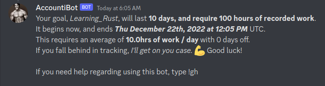
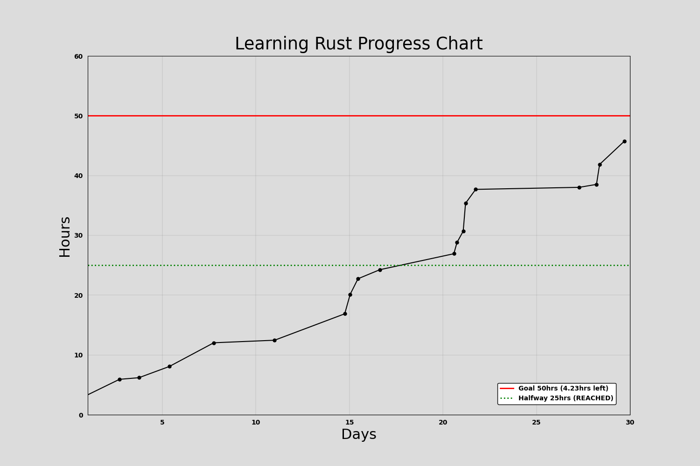
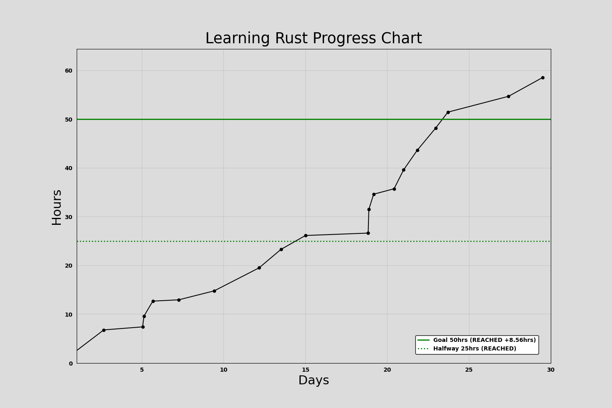

# AccountiBot Discord Bot

Accountibot is a discord bot Discord bot that will keep track of progress towards goals. Here is an example of how to use it.

## Functionality

- **Create goals**
- **Time track with built-in stop watch**
- **Add hours manually**
- **List goals of other members**
- **Show current status of goal in message**
- **Show graph of progress**

### Incompleted

### Completed

## Invite this bot to your server
Invite URL = https://discord.com/api/oauth2/authorize?client_id=1047769932089282590&permissions=536267455568&scope=bot