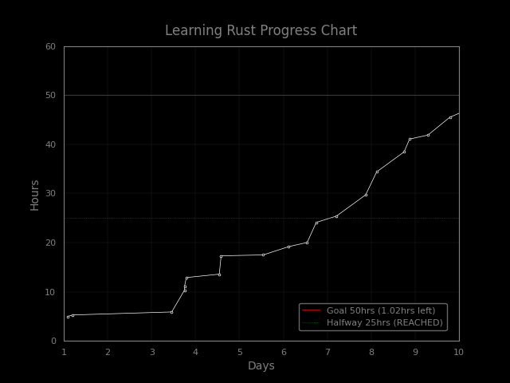
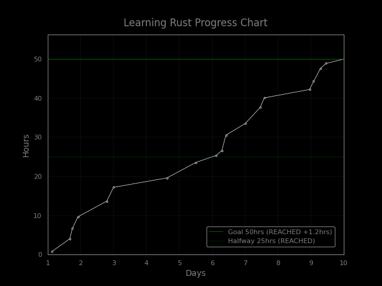

# AccountiBot 

Accountibot is a discord bot Discord bot that will keep track of progress towards goals. Here is an example of how to use it.

## Functionality 

**Add new goal**
!g [goal duration] [hours to work] [goal title] ?[rest days]

*Example:*
!g 10 30 beast_mode 2

Your goal, beast_mode, will last 10 days, and require 30 hours of recorded work.
It begins now, and ends Thur October 3rd, 2022 at 11:59 PM.
This requires an average of 3hrs of work / day with 2 days off.
If you fall behind in tracking, I'll get on you case. 

If you need help regarding using this bot, type !gh

**Add hours to goal**
!ga [goal_title] [time in hours / minutes]

*Examples:*
!ga beast_mode 1h55m
!ga beast_mode 3.5h
!ga beast_mode 23m
!ga beast_mode 90m

**Show graph of progress**
!gg [goal title]

## Graphs 

You can ask AccountiBot for current graph of progress and he will post this.

### Incompleted

### Completed

## Invite this bot to your server
Invite URL = https://discord.com/api/oauth2/authorize?client_id=1047769932089282590&permissions=536267455568&scope=bot